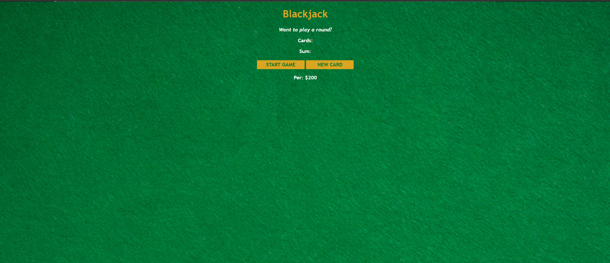

# 🃏 BlackJack Game  
  

## 📌 Project Overview  
This project is a **fun and interactive BlackJack Game** built using **HTML, CSS, and JavaScript**. The goal is to simulate a simple version of the popular card game BlackJack where players can test their luck and practice basic gaming strategies.  

## ✨ Features  
✅ **Card Dealing** – Draw cards with a click of a button  
✅ **Winner Detection** – Automatically determine the winner based on the BlackJack rules  
✅ **Score Tracking** – Keeps track of wins, losses, and draws  
✅ **Responsive Design** – Works perfectly across all devices  
✅ **Simple UI** – Clean and intuitive interface for smooth gameplay  

## 🔧 Tech Stack  
- **Frontend:** HTML, CSS, JavaScript  

## 🚀 Upcoming Features  
🔹 **Local Storage Integration** – Save game progress even after page reload  
🔹 **Multiple Players** – Add an option for multiplayer gaming  
🔹 **Sound Effects** – Enhance the gaming experience with audio feedback  
🔹 **Difficulty Levels** – Add different difficulty modes  

## 📽️ Project Demo  
### 🎥 Watch on YouTube  
[](https://youtu.be/7EhqTRT3G2A)  

## 📂 Installation & Usage  
1. Clone this repository:  
   ```bash
   git clone https://github.com/M-Meeran-Siddiqui/Black-Jack-Game.git
   ```

2. Open `index.html` in your browser to play the game.

